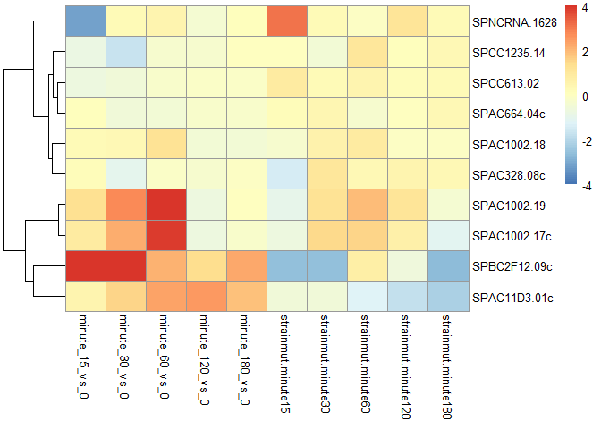

The fission dataset from Bioconductor is collected from an experiment where 2 groups of fission yeast, WT and mutant (*atf21* deletion) undergo oxidative stress. RNA-seq was performed for the two groups at 6 time points to measure gene expression levels.
--------------------------------------------------------------------------------------------------------------------------------------------------------------------------------------------------------------------------------------------------------------

##### Reference: <https://f1000researchdata.s3.amazonaws.com/manuscripts/9994/54602c98-5b2c-4d9d-9004-4e1f2c4e52c6_7035_-_michael_love_v2.pdf?doi=10.12688/f1000research.7035.2>

``` r
library(fission)
```

    ## Loading required package: SummarizedExperiment

    ## Loading required package: GenomicRanges

    ## Loading required package: stats4

    ## Loading required package: BiocGenerics

    ## Loading required package: parallel

    ## 
    ## Attaching package: 'BiocGenerics'

    ## The following objects are masked from 'package:parallel':
    ## 
    ##     clusterApply, clusterApplyLB, clusterCall, clusterEvalQ,
    ##     clusterExport, clusterMap, parApply, parCapply, parLapply,
    ##     parLapplyLB, parRapply, parSapply, parSapplyLB

    ## The following objects are masked from 'package:stats':
    ## 
    ##     IQR, mad, sd, var, xtabs

    ## The following objects are masked from 'package:base':
    ## 
    ##     anyDuplicated, append, as.data.frame, cbind, colMeans,
    ##     colnames, colSums, do.call, duplicated, eval, evalq, Filter,
    ##     Find, get, grep, grepl, intersect, is.unsorted, lapply,
    ##     lengths, Map, mapply, match, mget, order, paste, pmax,
    ##     pmax.int, pmin, pmin.int, Position, rank, rbind, Reduce,
    ##     rowMeans, rownames, rowSums, sapply, setdiff, sort, table,
    ##     tapply, union, unique, unsplit, which, which.max, which.min

    ## Loading required package: S4Vectors

    ## 
    ## Attaching package: 'S4Vectors'

    ## The following object is masked from 'package:base':
    ## 
    ##     expand.grid

    ## Loading required package: IRanges

    ## Loading required package: GenomeInfoDb

    ## Loading required package: Biobase

    ## Welcome to Bioconductor
    ## 
    ##     Vignettes contain introductory material; view with
    ##     'browseVignettes()'. To cite Bioconductor, see
    ##     'citation("Biobase")', and for packages 'citation("pkgname")'.

    ## Loading required package: DelayedArray

    ## Loading required package: matrixStats

    ## Warning: package 'matrixStats' was built under R version 3.4.1

    ## 
    ## Attaching package: 'matrixStats'

    ## The following objects are masked from 'package:Biobase':
    ## 
    ##     anyMissing, rowMedians

    ## 
    ## Attaching package: 'DelayedArray'

    ## The following objects are masked from 'package:matrixStats':
    ## 
    ##     colMaxs, colMins, colRanges, rowMaxs, rowMins, rowRanges

    ## The following object is masked from 'package:base':
    ## 
    ##     apply

``` r
data(fission)
```

### After importing the SummarizedExperiment dataset fission, view the columns and row values.

``` r
colData(fission)
```

    ## DataFrame with 36 rows and 4 columns
    ##              strain   minute replicate          id
    ##            <factor> <factor>  <factor> <character>
    ## GSM1368273       wt        0        r1     wt_0_r1
    ## GSM1368274       wt        0        r2     wt_0_r2
    ## GSM1368275       wt        0        r3     wt_0_r3
    ## GSM1368276       wt       15        r1    wt_15_r1
    ## GSM1368277       wt       15        r2    wt_15_r2
    ## ...             ...      ...       ...         ...
    ## GSM1368304      mut      120        r2  mut_120_r2
    ## GSM1368305      mut      120        r3  mut_120_r3
    ## GSM1368306      mut      180        r1  mut_180_r1
    ## GSM1368307      mut      180        r2  mut_180_r2
    ## GSM1368308      mut      180        r3  mut_180_r3

``` r
rowData(fission)
```

    ## DataFrame with 7039 rows and 2 columns
    ##               symbol        biotype
    ##          <character>       <factor>
    ## 1               tlh1 protein_coding
    ## 2        SPAC212.09c     pseudogene
    ## 3         SPNCRNA.70          ncRNA
    ## 4         SPAC212.12 protein_coding
    ## 5        SPAC212.04c protein_coding
    ## ...              ...            ...
    ## 7035 SPMITTRNATYR.01           tRNA
    ## 7036 SPMITTRNAILE.02           tRNA
    ## 7037            atp9 protein_coding
    ## 7038 SPMITTRNAGLU.01           tRNA
    ## 7039            cox2 protein_coding

### To view different groups in this experiment.

``` r
fission$strain
```

    ##  [1] wt  wt  wt  wt  wt  wt  wt  wt  wt  wt  wt  wt  wt  wt  wt  wt  wt 
    ## [18] wt  mut mut mut mut mut mut mut mut mut mut mut mut mut mut mut mut
    ## [35] mut mut
    ## Levels: wt mut

### Construct DESeqDataset Object for downstream analysis in DESeq2 library.

``` r
library("genefilter")
```

    ## 
    ## Attaching package: 'genefilter'

    ## The following objects are masked from 'package:matrixStats':
    ## 
    ##     rowSds, rowVars

``` r
library(DESeq2)

#design refers to variables for differential expression (including interaction effect)
fission_dsd<-DESeqDataSet(fission, design = ~ strain + minute + strain:minute)
```

### the rlog-transformed function transforms count data to homoskedastic distribution.

``` r
rld <- rlog(fission_dsd)
```

### Calculate sample similarity using dist() function to obtain Euclidean distance between samples.

#### Note: dist() expects the different samples to be rows of the matrix.

``` r
similarity_matrix<-dist(t(assay(rld)))
```

### Visualize similarity/distance using heat map.

``` r
library(pheatmap)
```

    ## Warning: package 'pheatmap' was built under R version 3.4.1

``` r
library("RColorBrewer")

dist_matrix <- as.matrix( similarity_matrix)
#rename rows to show treatment group description
rownames(dist_matrix ) <- paste( rld$strain, rld$minute, sep="-" )
colnames(dist_matrix ) <- NULL
colors <- colorRampPalette( rev(brewer.pal(9, "Purples")) )(255)
pheatmap(dist_matrix,
         clustering_distance_rows=similarity_matrix,
         clustering_distance_cols=similarity_matrix,
         col=colors)
```


### Use PCA to look at data in low dimension - plotPCA() produces a Principal Component Analysis (PCA) plot of the counts in object.

``` r
library(ggplot2)
#intgroup is variables of interest

pcadata <- plotPCA(rld,intgroup = c( "strain", "minute"), returnData=TRUE)
percentVar <- round(100 * attr(pcadata, "percentVar"))
ggplot(pcadata, aes(PC1, PC2, color=minute, shape=strain)) + geom_point(size=3) +xlab(paste0("PC1: ",percentVar[1],"% variance")) +
  ylab(paste0("PC2: ",percentVar[2],"% variance"))
```


``` r
library("pcaExplorer")
```

    ## 

``` r
groups=colData(rld)$strain
cols <- scales::hue_pal()(2)[groups]
#don't use row names, too many genes
genespca(rld,ntop=100,
         choices = c(1,2),
         arrowColors=cols,groupNames=groups,
         alpha = 0.3,
         useRownamesAsLabels=F,
         varname.size = 4
        )
```


### In the two PCA plots, there does not seem to be a difference between the mutant and WT representations, but the time point data show distinct clustering. This is because the first PCA plot corresponds to aggregation of all genes in the data. To look at the difference of mutant vs. WT, we can perform differential expression analysis on the count data matrix to gain more insights.

### Use likelyhood ratio test (LRT) to test for genes expressing strain-specific diff. over time course (i.e., interaction term strain:minute).

``` r
diff_timepoint<- DESeq(fission_dsd, test="LRT", reduced = ~ strain + minute)
```

    ## estimating size factors

    ## estimating dispersions

    ## gene-wise dispersion estimates

    ## mean-dispersion relationship

    ## final dispersion estimates

    ## fitting model and testing

``` r
class(diff_timepoint)
```

    ## [1] "DESeqDataSet"
    ## attr(,"package")
    ## [1] "DESeq2"

``` r
#to show the data table
timepoint_result<-results(diff_timepoint)
class(timepoint_result)
```

    ## [1] "DESeqResults"
    ## attr(,"package")
    ## [1] "DESeq2"

``` r
timepoint_result$symbol<-mcols(diff_timepoint)$symbol
head(timepoint_result[order(timepoint_result$padj),],4)
```

    ## log2 fold change (MLE): strainmut.minute180 
    ## LRT p-value: '~ strain + minute + strain:minute' vs '~ strain + minute' 
    ## DataFrame with 4 rows and 7 columns
    ##               baseMean log2FoldChange     lfcSE      stat       pvalue
    ##              <numeric>      <numeric> <numeric> <numeric>    <numeric>
    ## SPBC2F12.09c  174.6712    -2.65671953 0.7522613  97.28339 1.974151e-19
    ## SPAC1002.18   444.5050    -0.05093214 0.2042995  56.95360 5.169552e-11
    ## SPAC1002.19   336.3732    -0.39274898 0.5734940  43.53391 2.879804e-08
    ## SPAC1002.17c  261.7731    -1.13876477 0.6061288  39.31584 2.051371e-07
    ##                      padj      symbol
    ##                 <numeric> <character>
    ## SPBC2F12.09c 1.334526e-15       atf21
    ## SPAC1002.18  1.747308e-07        urg3
    ## SPAC1002.19  6.489157e-05        urg1
    ## SPAC1002.17c 3.466817e-04        urg2

``` r
#name of the gene with the smallest padj val
rownames(timepoint_result[which.min(timepoint_result$padj),])
```

    ## [1] "SPBC2F12.09c"

``` r
#As shown above, the top gene SPBC2F12.09c corresponds to the atf21 gene that's been mutated in this experiment. Let's look at other genes affected by this mutant, namely the one that has the most significant adjusted p-value after atf21.
gene_id<-rownames(timepoint_result[order(timepoint_result$padj),][2,])
genename<-timepoint_result[gene_id,"symbol"]

#plotCounts take DESeqdataset object
data <- plotCounts(diff_timepoint, gene_id,
        intgroup=c("minute","strain"),returnData=TRUE)


ggplot(data, aes(x=minute, y=count, color=strain, group=strain)) +
  geom_point() + stat_smooth(se=FALSE,method="loess") + scale_y_log10()+ggtitle(sprintf("Count for gene %s as function of time ", genename))
```


### Urg3 stands for Uracil Regulatable Gene. Its transcript levels increases in response to uracil in yeast organisms.To better compare the expression difference between WT and mutant, log2fold changes at the individual timepoints are examined.

``` r
resultsNames(diff_timepoint)
```

    ##  [1] "Intercept"           "strain_mut_vs_wt"    "minute_15_vs_0"     
    ##  [4] "minute_30_vs_0"      "minute_60_vs_0"      "minute_120_vs_0"    
    ##  [7] "minute_180_vs_0"     "strainmut.minute15"  "strainmut.minute30" 
    ## [10] "strainmut.minute60"  "strainmut.minute120" "strainmut.minute180"

``` r
tp15 <- results(diff_timepoint, name="strainmut.minute15", test="Wald")[gene_id,]
tp30<-results(diff_timepoint, name="strainmut.minute30", test="Wald")[gene_id,]
tp60<-results(diff_timepoint, name="strainmut.minute60", test="Wald")[gene_id,]
tp120<-results(diff_timepoint, name="strainmut.minute120", test="Wald")[gene_id,]
tp180<-results(diff_timepoint, name="strainmut.minute180", test="Wald")[gene_id,]

log2_change<-c(tp15$log2FoldChange, tp30$log2FoldChange, tp60$log2FoldChange, tp120$log2FoldChange, tp180$log2FoldChange)
Minute<-c(15,30,60,120,180)
se<-c(tp15$lfcSE, tp30$lfcSE, tp60$lfcSE, tp120$lfcSE,tp180$lfcSE)
time_data<-data.frame(Minute, log2_change,se)

ggplot(time_data,aes(x=Minute, y=log2_change))+geom_point(color='#336666')+geom_errorbar(aes(ymin=log2_change-se, ymax=log2_change+se), width=.1,color='#336666')+geom_line(color='#336666')+
  ggtitle(sprintf("Log2 fold change for gene %s between mutant and WT over time", genename))
```


Cluster top10 significant Genes based on log2fold change values. Note that this heatmap doesn't take into account the adjusted P-values and its associated confidence in the log2fold change detected (Gene id SPAC1002.18 corresponds to the Urg3 gene).
---------------------------------------------------------------------------------------------------------------------------------------------------------------------------------------------------------------------------------------------------------

``` r
weights<- coef(diff_timepoint)
colnames(weights)
```

    ##  [1] "Intercept"           "strain_mut_vs_wt"    "minute_15_vs_0"     
    ##  [4] "minute_30_vs_0"      "minute_60_vs_0"      "minute_120_vs_0"    
    ##  [7] "minute_180_vs_0"     "strainmut.minute15"  "strainmut.minute30" 
    ## [10] "strainmut.minute60"  "strainmut.minute120" "strainmut.minute180"

``` r
#interested in significantly different genes. Sort to get the indices
topGenes<-head(order(timepoint_result$padj),10)
#get the coefficients of the top genes
mat<-weights[topGenes, -c(1,2)]
thr <- 4
mat[mat < -thr] <- -thr
mat[mat > thr] <- thr
pheatmap(mat, breaks=seq(from=-thr, to=thr, length=100),cluster_col=F)
```



### The bottom 4 rows of the heatmap shows genes that exhibit the biggest log2fold change difference between the baseline WT (bottome left) time course and the Mutant group (bottome right). Again, this doesn't take into account the adjusted p-value.

``` r
sessionInfo()
```

    ## R version 3.4.0 (2017-04-21)
    ## Platform: x86_64-w64-mingw32/x64 (64-bit)
    ## Running under: Windows 7 x64 (build 7601) Service Pack 1
    ## 
    ## Matrix products: default
    ## 
    ## locale:
    ## [1] LC_COLLATE=English_United States.1252 
    ## [2] LC_CTYPE=English_United States.1252   
    ## [3] LC_MONETARY=English_United States.1252
    ## [4] LC_NUMERIC=C                          
    ## [5] LC_TIME=English_United States.1252    
    ## 
    ## attached base packages:
    ## [1] parallel  stats4    stats     graphics  grDevices utils     datasets 
    ## [8] methods   base     
    ## 
    ## other attached packages:
    ##  [1] pcaExplorer_2.2.0          ggplot2_2.2.1             
    ##  [3] RColorBrewer_1.1-2         pheatmap_1.0.8            
    ##  [5] DESeq2_1.16.1              genefilter_1.58.1         
    ##  [7] fission_0.110.0            SummarizedExperiment_1.6.3
    ##  [9] DelayedArray_0.2.7         matrixStats_0.52.2        
    ## [11] Biobase_2.36.2             GenomicRanges_1.28.3      
    ## [13] GenomeInfoDb_1.12.2        IRanges_2.10.2            
    ## [15] S4Vectors_0.14.3           BiocGenerics_0.22.0       
    ## [17] rmarkdown_1.6             
    ## 
    ## loaded via a namespace (and not attached):
    ##  [1] Category_2.42.1         bitops_1.0-6           
    ##  [3] bit64_0.9-7             doParallel_1.0.10      
    ##  [5] threejs_0.2.2           rprojroot_1.2          
    ##  [7] tools_3.4.0             backports_1.1.0        
    ##  [9] R6_2.2.2                DT_0.2                 
    ## [11] rpart_4.1-11            Hmisc_4.0-3            
    ## [13] DBI_0.7                 lazyeval_0.2.0         
    ## [15] colorspace_1.3-2        nnet_7.3-12            
    ## [17] gridExtra_2.2.1         bit_1.1-12             
    ## [19] compiler_3.4.0          graph_1.54.0           
    ## [21] htmlTable_1.9           SparseM_1.77           
    ## [23] pkgmaker_0.22           d3heatmap_0.6.1.1      
    ## [25] labeling_0.3            topGO_2.28.0           
    ## [27] scales_0.4.1            checkmate_1.8.3        
    ## [29] RBGL_1.52.0             NMF_0.20.6             
    ## [31] stringr_1.2.0           digest_0.6.12          
    ## [33] shinyBS_0.61            foreign_0.8-67         
    ## [35] AnnotationForge_1.18.0  XVector_0.16.0         
    ## [37] base64enc_0.1-3         pkgconfig_2.0.1        
    ## [39] htmltools_0.3.6         limma_3.32.3           
    ## [41] highr_0.6               htmlwidgets_0.9        
    ## [43] rlang_0.1.1             RSQLite_2.0            
    ## [45] shiny_1.0.3             GOstats_2.42.0         
    ## [47] jsonlite_1.5            BiocParallel_1.10.1    
    ## [49] acepack_1.4.1           RCurl_1.95-4.8         
    ## [51] magrittr_1.5            GO.db_3.4.1            
    ## [53] GenomeInfoDbData_0.99.0 Formula_1.2-2          
    ## [55] Matrix_1.2-9            Rcpp_0.12.12           
    ## [57] munsell_0.4.3           stringi_1.1.5          
    ## [59] yaml_2.1.14             zlibbioc_1.22.0        
    ## [61] plyr_1.8.4              grid_3.4.0             
    ## [63] blob_1.1.0              ggrepel_0.6.5          
    ## [65] shinydashboard_0.6.1    lattice_0.20-35        
    ## [67] splines_3.4.0           annotate_1.54.0        
    ## [69] locfit_1.5-9.1          knitr_1.16             
    ## [71] rngtools_1.2.4          reshape2_1.4.2         
    ## [73] geneplotter_1.54.0      codetools_0.2-15       
    ## [75] biomaRt_2.32.1          XML_3.98-1.9           
    ## [77] evaluate_0.10.1         latticeExtra_0.6-28    
    ## [79] data.table_1.10.4       foreach_1.4.3          
    ## [81] png_0.1-7               httpuv_1.3.5           
    ## [83] tidyr_0.6.3             gtable_0.2.0           
    ## [85] gridBase_0.4-7          mime_0.5               
    ## [87] xtable_1.8-2            survival_2.41-3        
    ## [89] tibble_1.3.3            iterators_1.0.8        
    ## [91] registry_0.3            AnnotationDbi_1.38.1   
    ## [93] memoise_1.1.0           cluster_2.0.6          
    ## [95] GSEABase_1.38.0         shinyAce_0.2.1
